# Import Dependency Graph

Mermaid diagram of all import relationships between schema files in `agr_curation_schema/model/schema/`.

**Note**: A 16-file strongly connected component (SCC) exists. The import graph is intentionally interdependent, not layered/DAG-style. Reviewers must reason about cross-module implications.

**SCC members**: affectedGenomicModel, agent, allele, allianceMember, controlledVocabulary, core, gene, image, ontologyTerm, phenotypeAndDiseaseAnnotation, reagent, reference, resource, resourceDescriptor, variantConsequence, variation

```mermaid
graph TD
  affectedGenomicModel --> core
  affectedGenomicModel --> allele
  agent --> core
  agent --> allianceMember
  agent --> resourceDescriptor
  allele --> affectedGenomicModel
  allele --> agent
  allele --> core
  allele --> image
  allele --> controlledVocabulary
  allele --> gene
  allele --> variation
  allele --> ontologyTerm
  allele --> phenotypeAndDiseaseAnnotation
  allele --> reagent
  allianceMember --> core
  allianceMember --> agent
  allianceMember --> reference
  biologicalEntitySet --> core
  biologicalEntitySet --> gene
  bulkload --> core
  bulkload --> ingest
  controlledVocabulary --> core
  controlledVocabulary --> ontologyTerm
  core --> reference
  core --> resource
  core --> agent
  core --> image
  core --> ontologyTerm
  core --> controlledVocabulary
  core --> resourceDescriptor
  core --> affectedGenomicModel
  curationReport --> core
  expression --> affectedGenomicModel
  expression --> allele
  expression --> reagent
  expression --> core
  expression --> gene
  expression --> image
  expression --> ontologyTerm
  expression --> phenotypeAndDiseaseAnnotation
  expression --> reference
  gene --> core
  gene --> ontologyTerm
  geneInteraction --> allele
  geneInteraction --> core
  geneInteraction --> gene
  geneInteraction --> reference
  highThroughputExpression --> core
  highThroughputExpression --> expression
  highThroughputExpression --> allele
  highThroughputExpression --> affectedGenomicModel
  homology --> core
  homology --> gene
  image --> core
  image --> allele
  ingest --> core
  ingest --> reagent
  ingest --> allele
  ingest --> gene
  ingest --> image
  ingest --> variation
  ingest --> ontologyTerm
  ingest --> affectedGenomicModel
  ingest --> phenotypeAndDiseaseAnnotation
  ingest --> variantDTO
  modCorpusAssociation --> core
  modCorpusAssociation --> allianceMember
  modCorpusAssociation --> reference
  ontologyTerm --> core
  ontologyTerm --> allele
  phenotypeAndDiseaseAnnotation --> reference
  phenotypeAndDiseaseAnnotation --> core
  phenotypeAndDiseaseAnnotation --> gene
  phenotypeAndDiseaseAnnotation --> allele
  phenotypeAndDiseaseAnnotation --> ontologyTerm
  reagent --> core
  reagent --> gene
  reagent --> reference
  reference --> core
  resource --> core
  resourceDescriptor --> core
  resourceDescriptor --> affectedGenomicModel
  variantConsequence --> core
  variantConsequence --> variation
  variantDTO --> core
  variantDTO --> variation
  variantDTO --> allele
  variation --> core
  variation --> allele
  variation --> ontologyTerm
  variation --> variantConsequence
```

